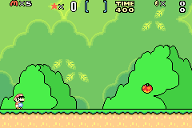
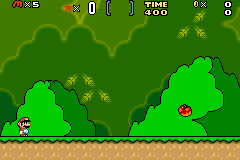

Until recently I hadn't realised a lot of early games on the Game Boy Advance were altered pretty significantly regarding colours and contrast levels in order to accommodate the original handheld's lack of a light (be it front or back light). Games were made brighter so that they'd be easier to see on the original console's dim screen, but with the onset of the frontlit Game Boy Advance SP (and especially the subsequent superior backlit [AGS-101 SP](https://en.wikipedia.org/wiki/Game_Boy_Advance_SP#Backlit_Model_.28AGS-101.29) model and [Game Boy Advance Micro](https://en.wikipedia.org/wiki/Game_Boy_Micro)) it left those games looking less-than-ideal on the newer hardware.

People being great and intuitive as they are have gone about trying to fix some of these problems with retro games in order to take into account that most people nowadays will look to play them on properly lit displays. People like Asaki over at the [Super Mario Advance 2 Colour Restoration](http://asaki.webs.com/smwcr/) website.

